# Aggregate Loss Calculator with VBA

This repository contains Visual Basic code that computes the discrete aggregate losses distribution from the inputs of discretized frequency and severity distributions. The user is recommended to run the program on Microsoft Excel. 

___
## Overview

- [Project Description](#Project-Description)
- [Inputs](#Inputs)
- [Computation and Output](#Computation-and-Output)
- [Underlying Mathematics](#Underlying-Mathematics)
- [Authorship](#Authorship)

___
## Project Description

A vital part to sustaining an insurance company consists of two estimations: (i) the amount required to reserve for future claim payments, and (ii) the proper prices for future policies. Both of them are performed based on past claim data, which have been shown to be modeled most accurately by separating them into frequency (number of claims per exposure) and severity (amount per claim), each modeled by a probability distribution. Afterwards, the frequency and severity distributions are combined into the aggregate losses (total losses per exposure) distribution.

This is where the project comes in. This project provides a Visual Basic code that operates on Microsoft Excel and takes as inputs the discrete (or discretized) frequency and severity distributions. The input must be in the format of a table of discrete frequency/severity values, each provided with its probability function. The user can provide these inputs through the included input forms, external scripts or manual inputs. The program then computes the resulting aggregate losses distribution and displays it in the table format on a separate Excel worksheet. The details of how each step works is provided below. 

[Back to Overview](#overview)
___
## Inputs

The Excel file contains three worksheets: Frequency, Severity and Aggregate Losses. As the names suggest, each sheet holds the table representing the discrete probability function of the corresponding quantity. For instance, the original Frequency worksheet is displayed below.

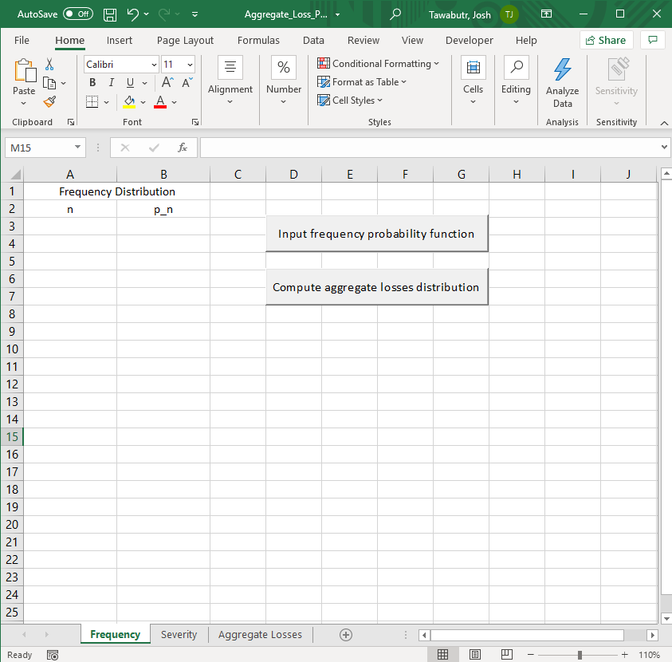</img>

Besides the table mentioned above, the worksheet has two buttons. The top button launches a form that allows the user to add rows to the table, while the bottom button launches a form that allows the user to execute aggregate losses computation. The Aggregate Losses worksheet only has the latter button. 

Once the user clicks on the "Input frequency probability function" button, the input form shown below will be launched. 

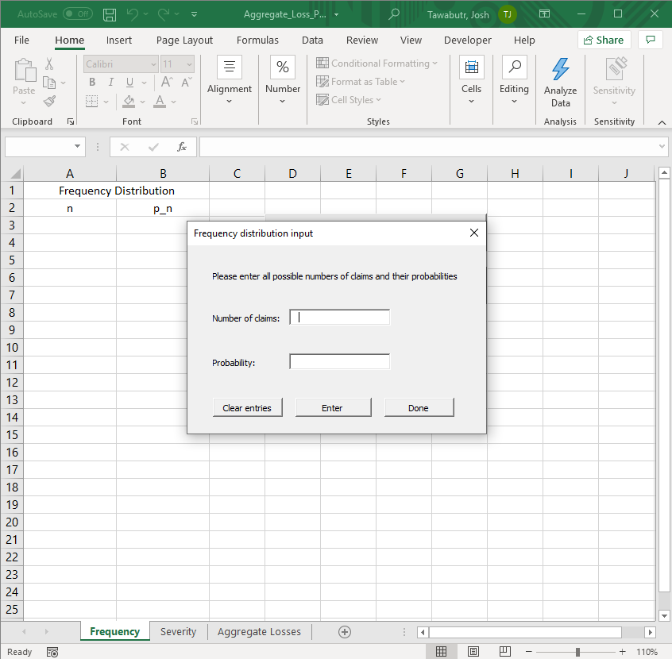</img>

The form allows the user to input the frequency value and its corresponding probability, one pair at a time. The form also controls for the proper value of probability input. For example, if a user inputs a negative probability by mistake, the following warning box will be displayed. 

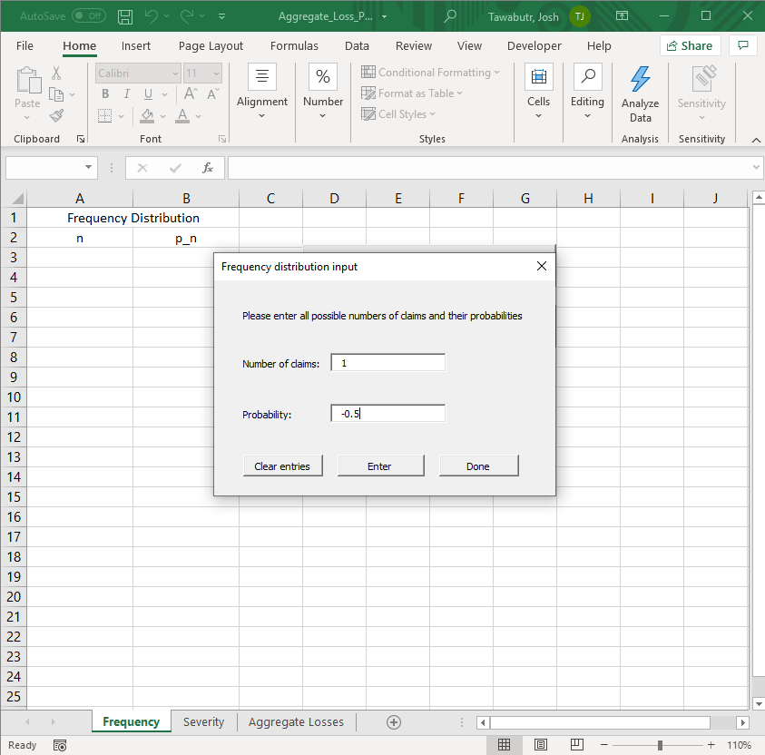</img>      
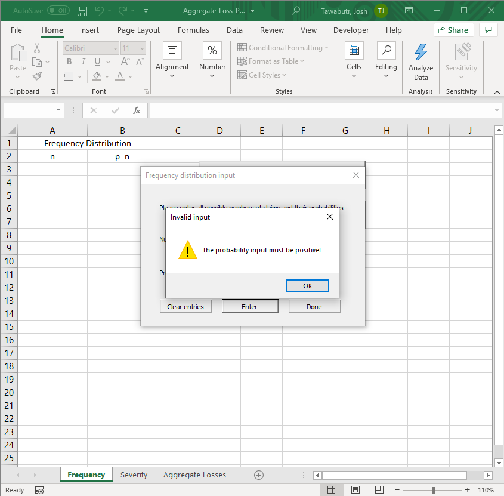</img>

Furthermore, if the input probability would make the total probability sum to a number above one, the program will display the following warning box. 

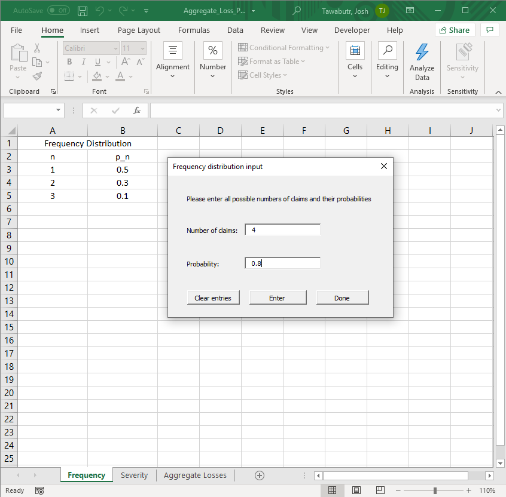</img>      
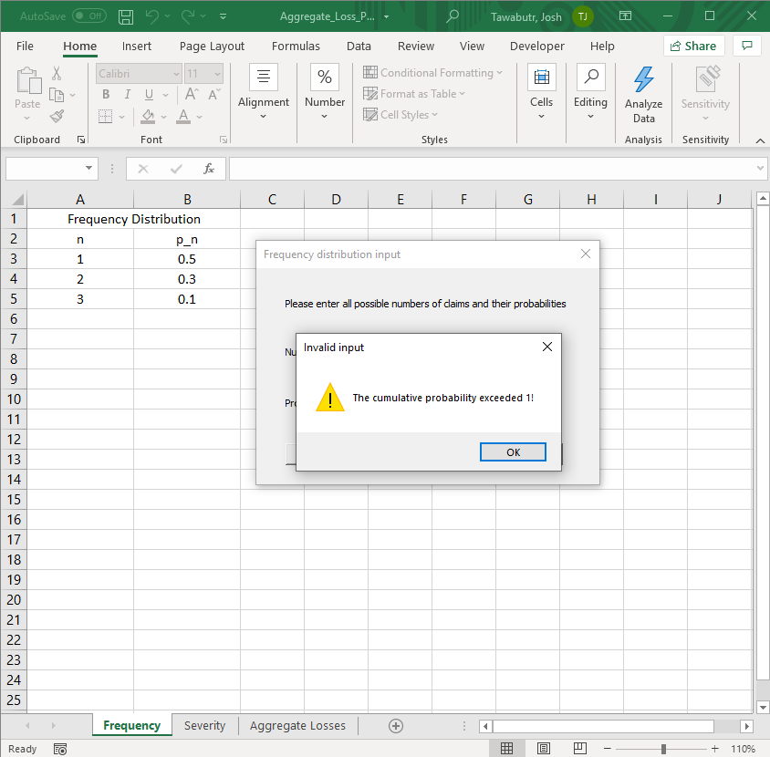</img>

Once the whole frequency distribution is given, the user proceeds to do the same with the severity distribution. This is done in the Severity worksheet shown below, together with the severity input form. 

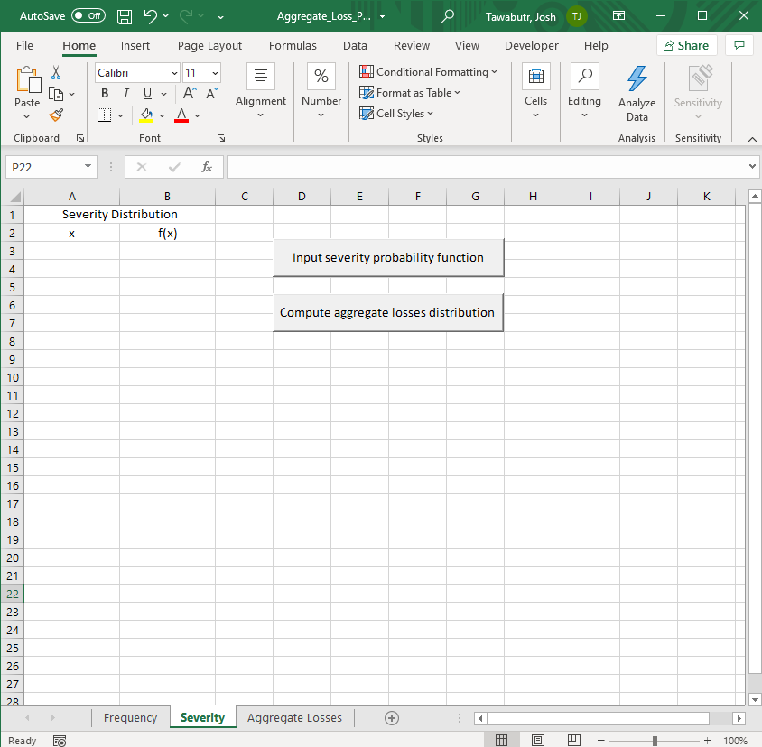</img>      
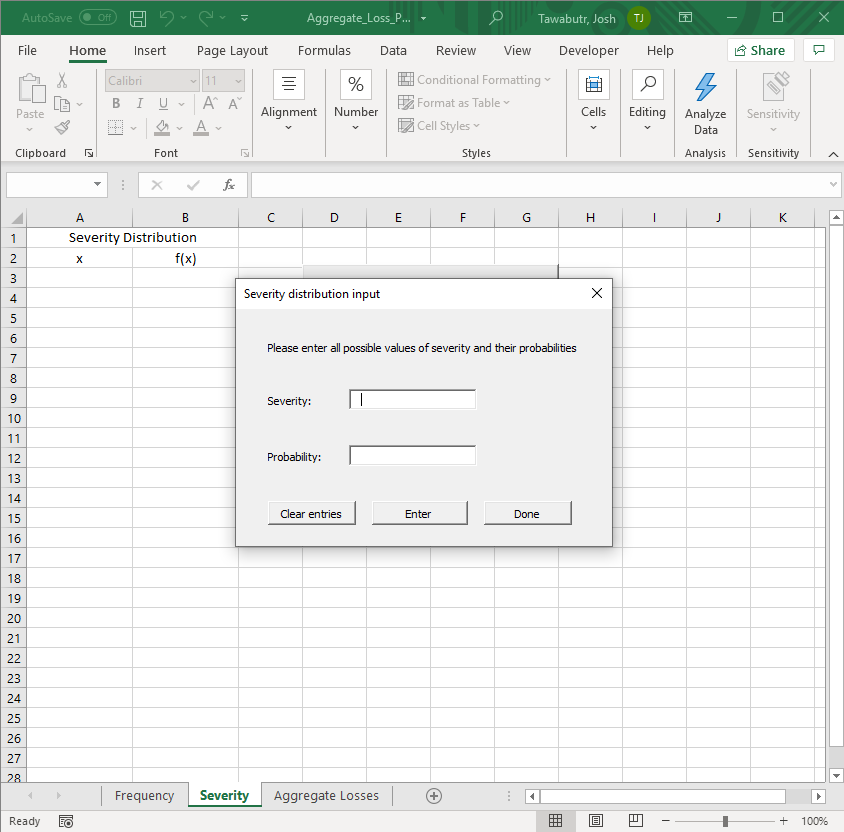</img>

Alternative ways the user can input the frequency and severity distributions include the use of an external script to fill the tables in the corresponding worksheets. The user can also put the numbers in manually. However, if the inputs are given in these alternative ways, the program will not check for errors in the input until the actual computation is launched.

[Back to Overview](#overview)
___
## Computation and Output

Once all the inputs are correctly given, the user can start the aggregate losses computation from any of the three worksheets by clicking the "Compute aggregate losses distribution" button, which launches the form displayed below.

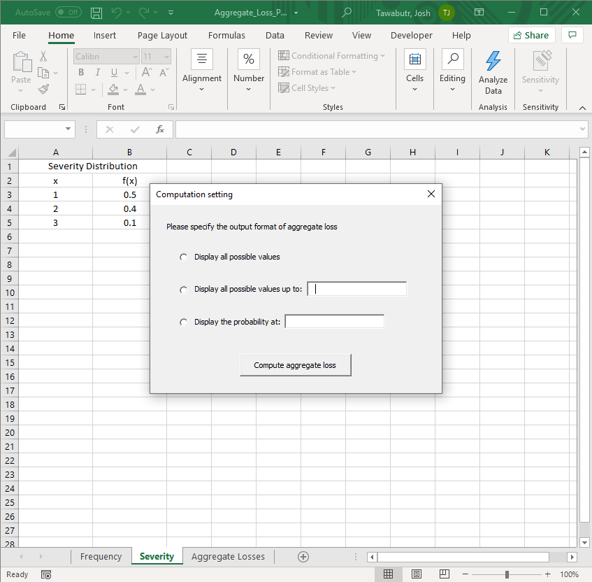</img>

As the form suggests, there are three options the user can choose for the output to be displayed. The first displays all values and probabilities of aggregate losses with nonzero probability. The second option does not display the rows with large aggregate losses whose values are greater than the specified value, i.e. the distribution tail. Finally, the third option only displays the specific aggregate losses value given by the user and its probability. 

Before executing the actual computation, the program checks once more if the input frequency and severity distributions are valid, i.e. all probabilities sum to one, with each being between zero and one. For example, if one of the given probability functions do not sum to one, the following warning will be displayed.

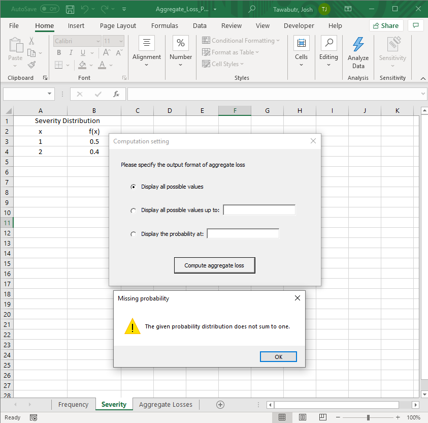</img>

If the given distributions are valid, then the program proceeds to compute the aggregate losses distribution. Before the results are displayed, if the Aggregate Losses worksheet is not blank, e.g. filled with a previous result, the following warning box will be displayed.

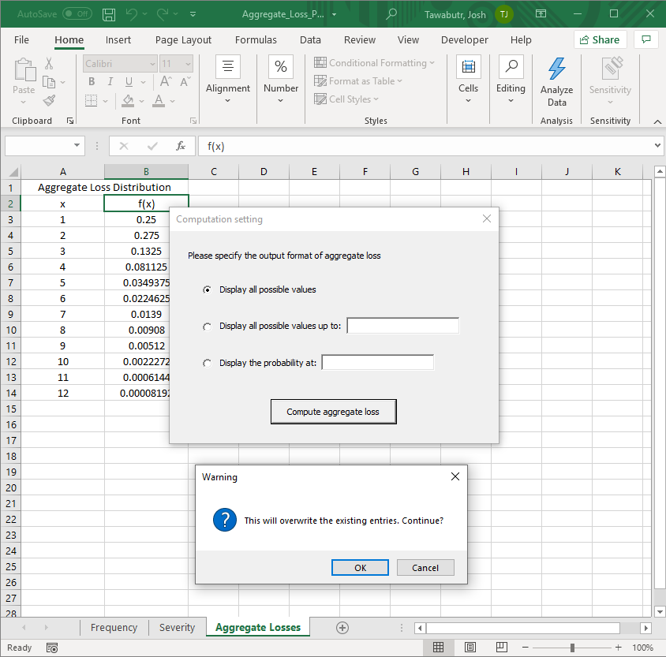</img>

Once the user clicks OK, the results will be automatically displayed as follows.

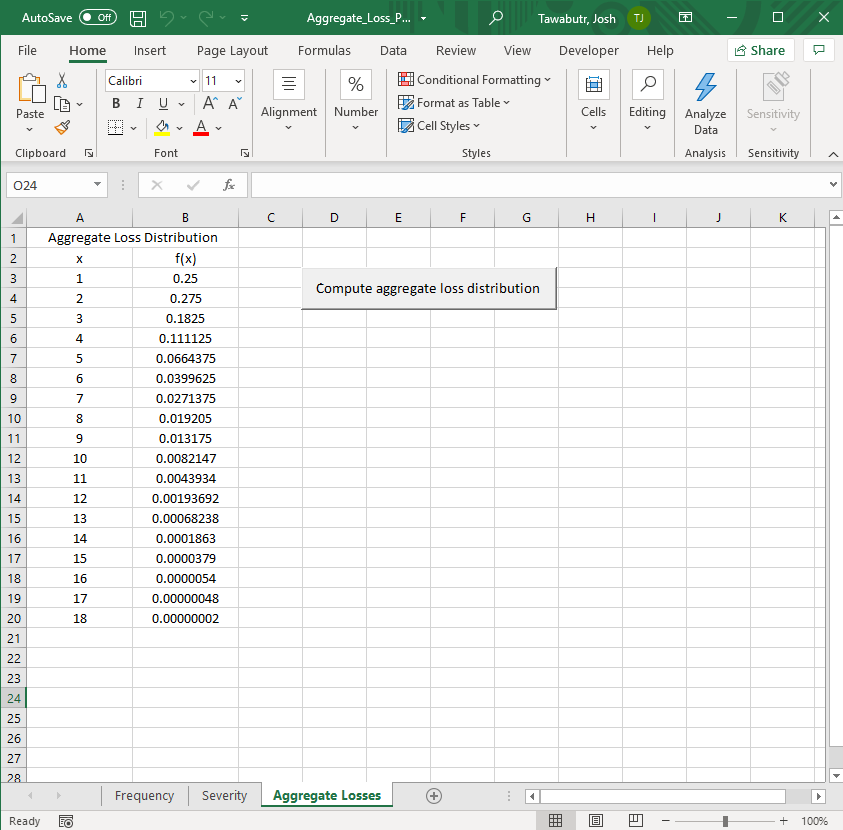</img>      
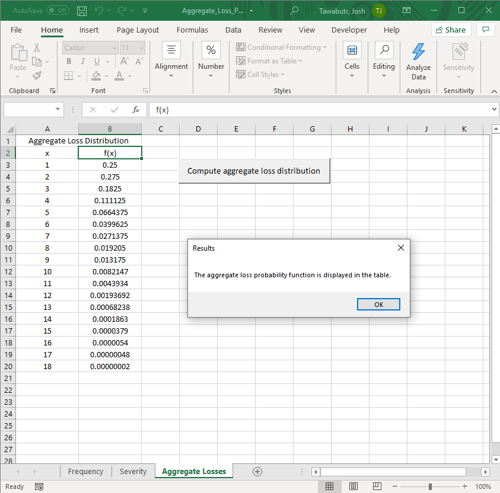</img>

This completes the computation of aggregate losses distribution based on the given discrete frequency and severity distributions.

[Back to Overview](#overview)
___
## Underlying Mathematics

Let  be the probability function of the frequency where , and let  be the probability function of the severity where 0" title="S>0" />. Note that `S` is nonzero because we count the frequency in the per-payment fashion, that is, a loss below deductible does not count towards the frequency.

[Back to Overview](#overview)
___
## Authorship

This project is developed by Yossathorn (Josh) Tawabutr. For more information, please contact: tawabutr.1@osu.edu

